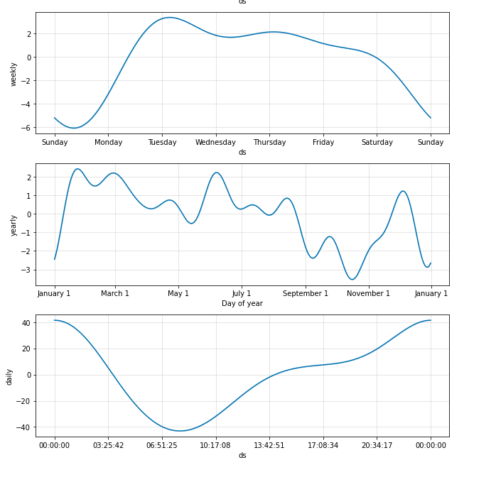

# module_11_challenge

The module11 challenge for fintech course

The Jupyter Lab file, designed to be used in Google Colab follows along to create, update and work with Meta Prophet forecasting tools.
---

## Technologies

The sheet requires Pandas for analyzing data frames in jupyter labs.
It requires Jupyter Labs for a user interface, but is primarily run through Google Colab
It requires Path from pathlib to help read .csv files.
Requires hvplot and fbphophet.

Since the worksheet runs on Google Colab, none of the dependencies need to be installed locally.  The worksheet installs everything necessary in your Colab instance.

---

## Installation Guide

Launch Google Colab by navigating here: [Googel Cloab](https://colab.research.google.com/)

Choose Upload from the popup screen and select the worksheet.

The first few cells will install and launch all the dependencies.

Meta(FB) Prophet is utilized in the forecasting and information for it can be located here: [Meta Prophet](https://facebook.github.io/prophet/)

---

## Usage

The worksheet runs through a scenario and teaches the user to work with Google Colab, Meta Prophet and other forecasting tools.

---

## Contributors

Michael Canavan

---

## License

The content of the course is owned and managed by UC Berkeley Fintech Bootcamp.
